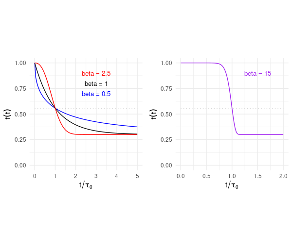
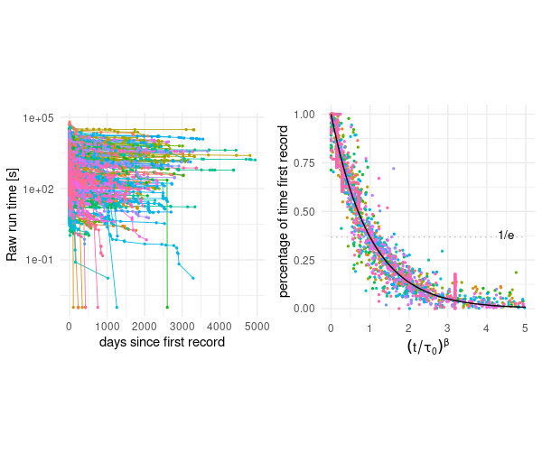

# Competitive optimisation in videogames speedrunning

## Download data from API and clean it

In order to compile our dataset we made use of the [api](https://github.com/speedruncomorg/api) provided by [speedrun.com](https://www.speedrun.com/). We wrote a series of functions in R
to query this data. These functions scrape speedrun.com to extract the world record progression of each record in the database. The scripts that contain the necessary functions to perform the scraping are found in `code/download_data_from_api/query_data_api.R`, this routine is executed by running the script `code/download_data_from_api/run_query_data_api.R`.

In addition to scraping the data describing the progression of world records, we also scraped metadata on the games, runs, and players. This scraping was performed by running the scripts `code/download_data_from_api/query_game_metadata.R`, `code/download_data_from_api/query_run_metadata.R`, and `code/download_data_from_api/query_player_metadata.R` respectively. 

Having downloaded the raw data, we then post-processed it by removing all NAs, as well as performing some transformations. We did the whole data wrangling using the script `code/process_downloaded_data/clean_api_data.R`. 

## Fit of decay curves

The time development speedrunning records is represented by a decaying function of time, which is typically different for different videogames.   

In our analysis we aimed at    
* recognizing common patterns in the time development of records for different games   
* classifying quantitatively the time decay of records obtained for different games by means of suitable parameters     
* exploring whether available metadata of different games could explain the differences observed in the time dependence of various speedrunning records, e.g., the longevity of records.      

### Stretched-exponential function

In order to normalize the decay of records obtained for different games, we focused on the relative improvement in speedrun, namely the ratio between a current record at time *t* and the first speedrun time uploaded on the server. After this normalization all decay curves would start from the value 1 on the first day of our timeline. 

A function which is widely used in science and technology to fit time decays is the stretched-exponential function   
<!--

-->

=\left(1-f_\infty\right)e^{-(t/\tau_0)^\beta}+f_\infty\qquad(1))

The parameters allow for enough flexibility to fit different shapes of decays and have the following meanings 

*  sterteching exponent  
*   characteristic lifetime    
*  final value of the decay    

In our case,  represents the intrinsic limitation to the relative improvement of a record for a specific game. 

Our analysis suggests that the time decays of records can be classified as 

* those in which improvements proceed **incrementally**      
* those in which improvements occurs abruptly, through **disruptive innovation**. 
 
The two types of behavior are exemplified in the following plots (left: incremental improvement, right: disruptive innovation):  

### Linear regression

As suggested during the lectures, whenever possible, it is recommended to transform the data in order that linear regression can be applied. This is possible if one assumes , in which case Eq.(1) can be linearized applying the transformation 

   

where , , and . 

We wrote the function `linear_regression_fit()` to linearize some data and perform the fitting, by means of the `lm` function of the `stats` R-package, that can be found in the file  `code/analyse_data/functions_fit.R`.   
This approach did not yield satisfactory results. Therefore, we included  as a fitting parameter and performed a non-linear regression of each decay. 
 

### Non-linear regression

In this case we wrote the function `stretched_exp_fit()` based on the `nlsLM` routine of the `minpack.lm` R-package, which is also contained in the file `code/analyse_data/functions_fit.R`. To suppress the intrinsic correlation between the  and  parameters in Eq.(1), we considered the equivalent equation 
<!--

-->

=\left(1-f_\infty\right)e^{-\lambda(t)^\beta}+f_\infty)

Yet, we could not achieve satisfactory convergence by fitting the 3 parameters  simultaneously. We circumvented this problem implementing a function that varied only  or the pair   in successive iterations. As a convergence criterion we used the value of .  
Besides this, our function `stretched_exp_fit()` also automate the definition of initial guesses for the parameters  depending on the data points present in each decay curve.     

### A posteriori data-claening and histogram of fitted parameters 

Equation (1) was fitted to **411** datasets (decay curves) containing at least 9 points each. 
To produce the plots of decay curves and histograms for 
 and  we filtered out results for which 

*  was smaller than 5 times the last data point in time (typical curves for which this occurred resembled a staircase)  
*  0.4">    
*         
where  is the error in the determination of 
 and  

     

the number of degrees of freedom (fitted parameters) being *k=3* in the present case. 

The script to visualize plots and histogram resulting from the fitting procedure can be found in the file `code/visualise_data/produce_plots.R`. 

### Data collapsing 

A standard procedure to verify (visually) to which extent a law is obeyed by a set of data is by replotting the training datasets as a so-called *master curve*, using the *a posteriori* knowledge of the fitted parameters. Starting from Eq.(1) the master curve  is obtained with the following transformation 

  
                   
If our data obeyed perfectly Eq.(1), they should collapse onto a single curve if plotted as  with   
   
    

Note that the parameters  are different for each fitted decay curve, labelled by the game id. 

On the left panel of the underlying figure the original representation of the datesets used to produce the histograms for  and  is displayed, while on the right pannel the same data is shown after the transformation defined by the master curve .          

## Prediction of fit parameters

We performed both supervised and unsupervised learning methods to predict the fitted parameters to the curve of a record from metainformation on the game itself. First, we performed a **Principal Component Analysis** using the following variables: 

* year of release: year the game was released
* number of runs: total number of attempts at setting a record
* days in the database: number of days the game has been archived in the database
* fraction of runs played on emulated systems
* number of unique players
* run production rate: total number of attempts at setting a record/ number of days the game has been archived in the database
* number of records
* record efficacy: number of records/total number of attempts at setting a record

We next extracted the first two principal components and mapped each record onto them. Finally, we checked whether or not the records with similar values of  or  were grouped together. We performed this principal component analysis using the script `code/analyse_data/principal_component_analysis.R`.

We then performed the **Random Forest Analysis** using the variables described above to predict the parameters  and  of each record. For each random forest fit, we computed its confusion matrix, accuracy and the importance of each variable. We performed this analysis using the script `code/analyse_data/random_forest_analysis.R`.

